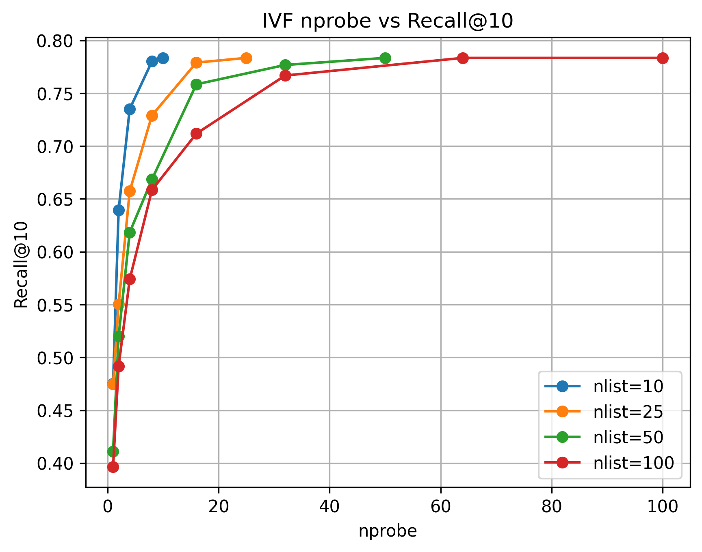
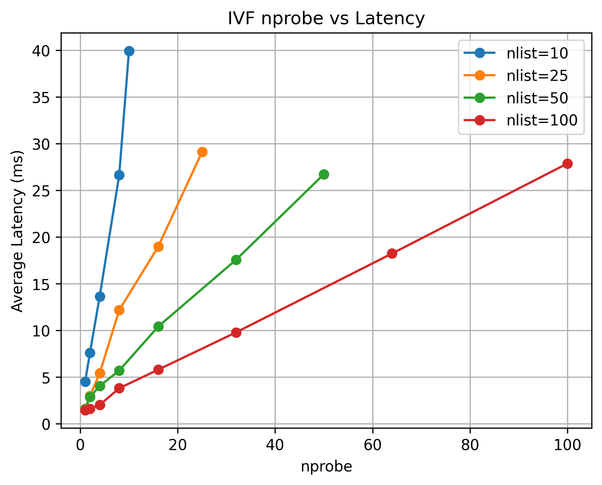
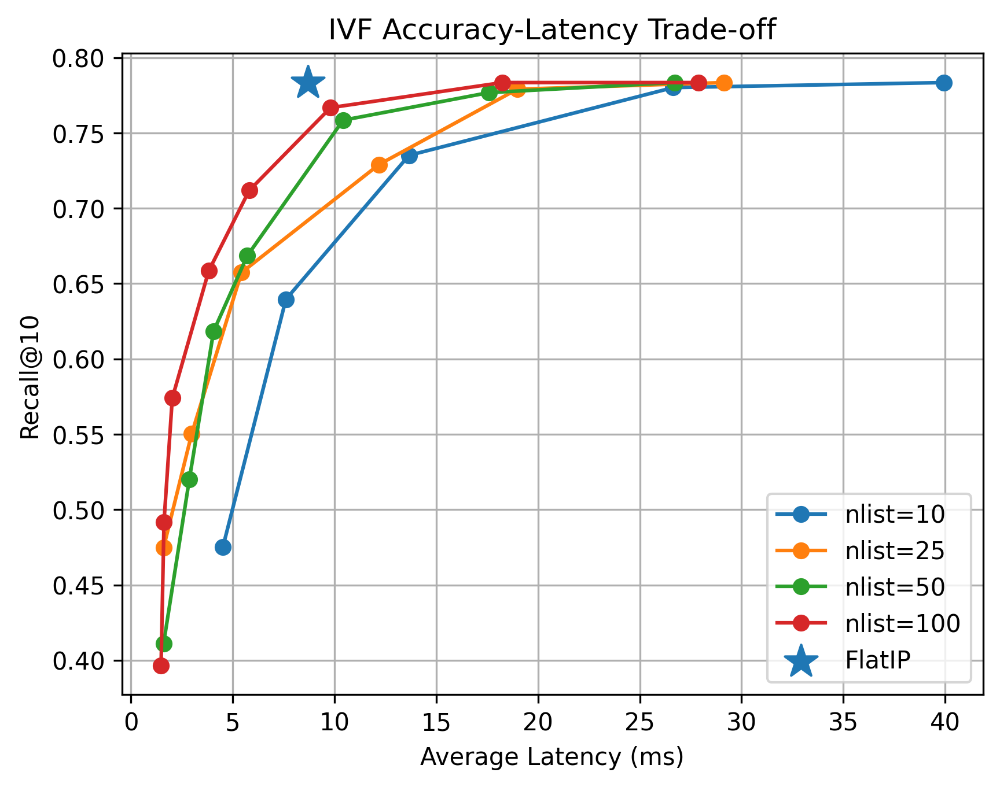

# [ RAG System Experiments ]

## ✅ Models & Components

- **Embedding:** BAAI/bge-m3 (1024 dim, L2 normalized)
- **Vector Search:** FAISS (IndexFlatIP / IndexIVFFlat)
- **Generation:** OpenAI GPT-OSS 20B via Groq

## ✅ Initial RAG Pipeline

초기에는 9개 문서 청크를 대상으로 RAG Pipeline을 구성하고 단계별 Latency를 측정했습니다.

- **Query:** `Astra는 해킹 능력이 어느 정도야?`
- **Top-K:** 3
- **Runs:** 10
- **Dataset:** 9개 청크(문단 단위로 분할)

| Stage | Average | Minimum | Maximum |
|---|---:|---:|---:|
| Query Embedding | 158.33 ms | 116.70 ms | 275.32 ms |
| FAISS Retrieval | 0.06 ms | 0.04 ms | 0.15 ms |
| Generation | 721.66 ms | 441.46 ms | 1628.31 ms |
| End-to-End | 880.07 ms | 568.80 ms | 1903.75 ms |

검색 대상이 9개 Vector에 불과했기 때문에, Retrieval 성능을 확인하기 위해 후속 실험에서는 검색 대상을 SciFact 5,183개 문서로 확장했습니다.

## FAISS Retrieval Experiment

FAISS `IndexFlatIP`를 비교 기준으로 설정하고, `IndexIVFFlat`의 `nlist`와 `nprobe`를 변화시키면서 Retrieval Latency와 Recall@10을 측정했습니다.

### Experiment Setup

| Item | Setting |
|---|---|
| Dataset | BEIR SciFact |
| Documents | 5,183 |
| Test Queries | 300 |
| Embedding Model | BAAI/bge-m3 |
| Embedding Dimension | 1024 |
| Top-K | 10 |
| Baseline | FAISS IndexFlatIP |
| Comparison | FAISS IndexIVFFlat |
| nlist | 10, 25, 50, 100 |
| nprobe | 1 ~ nlist |
| Latency Runs | 10 |
| Accuracy Metric | Recall@10 |

### Results

| Index | nlist | nprobe | Avg. Latency (ms) | Recall@10 |
|---|---:|---:|---:|---:|
| FlatIP | - | - | 8.70 | 0.7834 |
| IVF | 25 | 1 | 1.60 | 0.4749 |
| IVF | 25 | 4 | 5.43 | 0.6573 |
| IVF | 50 | 16 | 10.42 | 0.7584 |
| IVF | 100 | 8 | 3.82 | 0.6584 |
| IVF | 100 | 16 | 5.81 | 0.7118 |
| IVF | 100 | 32 | 9.81 | 0.7668 |
| IVF | 100 | 64 | 18.25 | 0.7834 |

전체 실험 결과는 `data/flat_results.csv`와 `data/ivf_results.csv`에 저장했습니다.

### nprobe vs Recall@10

### nprobe vs Retrieval Latency

### Accuracy-Latency Trade-off

`nprobe`가 증가할수록 더 많은 Cluster를 탐색하면서 Recall@10이 향상되었지만,
동시에 Retrieval Latency도 증가하는 trade-off를 확인했습니다.

예를 들어 `nlist=100`에서 `nprobe`를 8에서 32로 증가시키면
Recall@10은 0.6584에서 0.7668로 향상되었지만,
평균 Latency도 3.82 ms에서 9.81 ms로 증가했습니다.

또한 `nprobe=64` 이후에는 Recall@10이 0.7834로 더 이상 향상되지 않았지만,
`nprobe=100`에서는 평균 Latency가 27.89 ms까지 증가했습니다.

따라서 `nprobe`를 크게 설정하는 것이 항상 효율적인 것은 아니며,
요구되는 Retrieval Accuracy와 허용 가능한 Latency를 고려하여
적절한 탐색 범위를 선택할 필요가 있습니다.